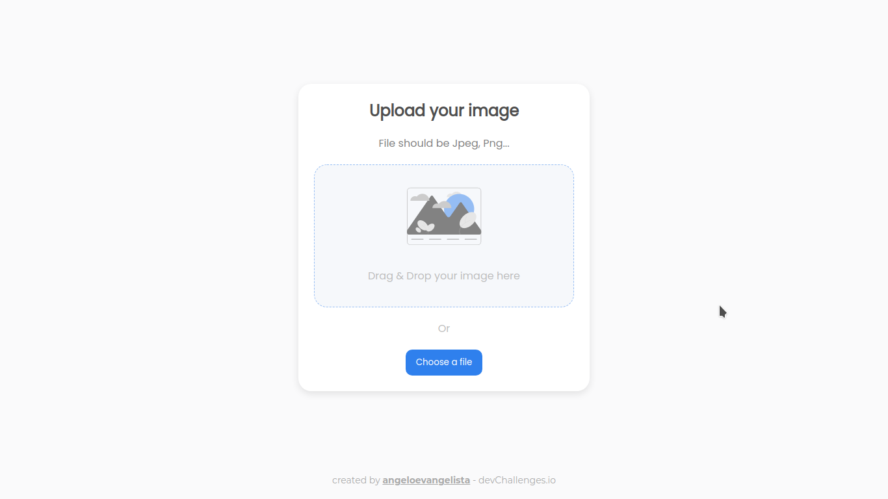

# Image Uploader

## **Challenge**

Create an Image Uploader application. Use any front-end libraries of your choice. Create your API. Don’t look at the existing solution. Fulfill user stories below:

- [x] I can drag and drop an image to upload it
- [x] I can choose to select an image from my folder
- [x] I can see a loader when uploading
- [ ] When the image is uploaded, I can see the image and copy it
- [ ] I can choose to copy to the clipboard

## Preview

